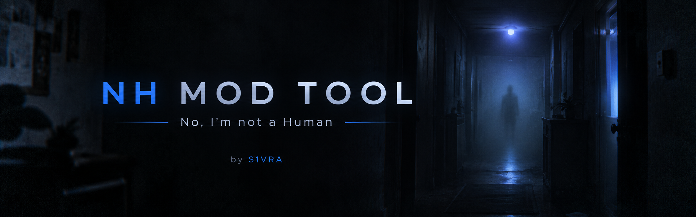

<p align="center">
  
</p>


<p align="center">
  <a href="https://github.com/S1VRA/UNHUMAN/releases"></a>
  
  
  
</p>


<h1 align="center">NH Mod Tool</h1>


<p align="center">
  A modern mod management tool for <b>"No, I'm not a Human"</b>, built with tkinter/ttk and an Obsidian dark theme.
</p>

---

## English

### Features

- **Photo Pack ZIP Import** – Import photo packs from `.zip` archives with automatic extraction and validation.
- **Mod Manager** – Enable, disable, install, and uninstall mods through a clean tabular interface.
- **Game Status** – Real-time detection of game installation, version, and running process.
- **Obsidian Dark Theme** – A polished dark UI built with tkinter/ttk styling.
- **i18n Support** – Full localization with English and Turkish language packs.
- **Settings** – Configure default directories, theme preferences, and backup intervals.

### Installation

#### Option 1: Download Pre-built EXE (Recommended)

1. Go to the [Releases page](https://github.com/S1VRA/UNHUMAN/releases)
2. Download `NHModTool_v0.4.0_win64.zip`
3. Extract the archive
4. Run `NHModTool.exe`

> ⚠️ **Windows SmartScreen warning:** On first launch, Windows may show
> "Windows protected your PC". Click "More info" → "Run anyway". This is
> normal for all open-source EXEs without a code signing certificate.

#### Option 2: Run from Source (For Developers)

```bash
git clone https://github.com/S1VRA/UNHUMAN.git
cd UNHUMAN
pip install -r requirements.txt
python NHModTool.py
```

### Usage

```bash
python NHModTool.py
```

### Build

```bash
build_release.bat
```

---

## Türkçe

### Özellikler

- **Photo Pack ZIP İçe Aktarma** – `.zip` arşivlerinden otomatik çıkarma ve doğrulama ile fotoğraf paketlerini içe aktarın.
- **Mod Yöneticisi** – Temiz bir arayüz üzerinden modları etkinleştirin, devre dışı bırakın, yükleyin ve kaldırın.
- **Oyun Durumu** – Oyun kurulumu, sürümü ve çalışan process hakkında gerçek zamanlı tespit.
- **Obsidian Karanlık Tema** – tkinter/ttk ile oluşturulmuş şık bir karanlık arayüz.
- **i18n Desteği** – İngilizce ve Türkçe dil paketleriyle tam yerelleştirme.
- **Ayarlar** – Varsayılan dizinleri, tema tercihlerini ve yedekleme aralıklarını yapılandırın.

### Kurulum

#### Seçenek 1: Hazır EXE İndir (Önerilen)

1. [Releases sayfasına](https://github.com/S1VRA/UNHUMAN/releases) gidin
2. `NHModTool_v0.4.0_win64.zip` dosyasını indirin
3. Arşivi çıkarın
4. `NHModTool.exe` dosyasını çalıştırın

> ⚠️ **Windows SmartScreen uyarısı:** İlk çalıştırmada "Windows korumalı seni"
> uyarısı çıkabilir. "Ek bilgi" → "Yine de çalıştır" seçin.

#### Seçenek 2: Kaynaktan Çalıştır (Geliştiriciler için)

```bash
git clone https://github.com/S1VRA/UNHUMAN.git
cd UNHUMAN
pip install -r requirements.txt
python NHModTool.py
```

### Kullanım

```bash
python NHModTool.py
```

### Derleme

```bash
build_release.bat
```

---

### Project Structure

```
UNHUMAN/
├── assets/       # Banner and images
├── data/         # Runtime user data (git-ignored)
├── dist/         # Built executables (git-ignored)
├── docs/         # Documentation
├── locales/      # Translation files (en.json, tr.json)
├── scripts/      # Build and utility scripts
├── tests/        # Test files
├── NHModTool.py  # Main application
├── theme.py      # Obsidian theme definitions
├── i18n.py       # Localization engine
└── requirements.txt
```

---

## Screenshots

> Screenshots coming soon.

---

## Links

- 🐛 [Report a bug](https://github.com/S1VRA/UNHUMAN/issues/new?template=bug_report.md)
- 💡 [Request a feature](https://github.com/S1VRA/UNHUMAN/issues/new?template=feature_request.md)
- 🔒 [Security policy](SECURITY.md)
- 📜 [Changelog](CHANGELOG.md)

## Antivirus

⚠️ **Antivirus False Positives**
- Some ML-based engines (Bkav Pro, SecureAge) may flag this EXE as malware.
- This is a **false positive** affecting all PyInstaller apps.
- Source: https://github.com/S1VRA/UNHUMAN

## License

MIT License. See [LICENSE](LICENSE) for details.

## Contributing

See [CONTRIBUTING.md](CONTRIBUTING.md) for guidelines.
