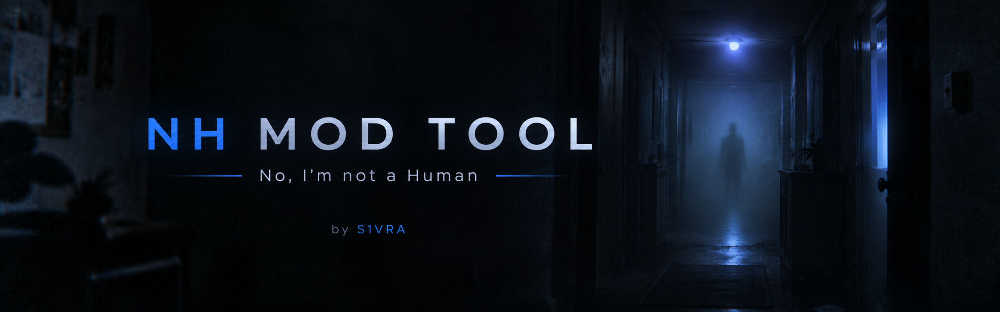

<p align="center">
  
</p>

<p align="center">
  <a href="https://github.com/S1VRA/UNHUMAN/releases"></a>
  
  
  
</p>

<h1 align="center">NH Mod Tool</h1>

<p align="center">
  A modern mod manager for <b>"No, I'm not a Human"</b>, built with Python + tkinter/ttk and ttkbootstrap (darkly theme).
</p>

---

## English

### Features

- **Photo Mods** — Replace in-game character textures with your own photos, one character at a time.
- **Photo Pack (ZIP)** — Apply many character images at once from a `.zip` archive.
- **Mod Manager** — Backups, restore points, and cache cleanup. Every apply keeps an automatic `.bak` next to the game file.
- **Game Status** — Real-time game file detection and integrity verification.
- **Bilingual UI** — Full English and Turkish localization with key parity.
- **Security Hardened** — ZIP Slip protection, ZIP bomb detection, magic-byte validation, and path-traversal guards.
- **Safe Writes** — Every modification is verified before commit; nothing is overwritten without a backup.

### Installation

#### Option 1: Installer (Recommended)

1. Go to the [Releases page](https://github.com/S1VRA/UNHUMAN/releases)
2. Download `NHModTool_v0.5.0_Setup.exe`
3. Run the installer and follow the wizard
4. Launch **NH Mod Tool** from the Start Menu

#### Option 2: Run from Source (For Developers)

```bash
git clone https://github.com/S1VRA/UNHUMAN.git
cd UNHUMAN
pip install -r requirements.txt
python NHModTool.py
```

### Usage

1. Open **Settings** and point the tool at your game's `sharedassets0.assets` file.
2. **Photo Mods** → pick a character → pick a photo → Apply.
3. Or **Photo Pack (ZIP)** → choose a ZIP → Apply ZIP to Game.

### Building

```bash
build_release.bat
```

Uses Nuitka (standalone) + Inno Setup (installer).

---

## Türkçe

### Özellikler

- **Fotoğraf Modları** — Oyun içi karakter dokularını kendi fotoğraflarınızla tek tek değiştirin.
- **Fotoğraf Paketi (ZIP)** — Bir `.zip` arşivinden çok sayıda karakter görselini tek seferde uygulayın.
- **Mod Yöneticisi** — Yedekler, geri yükleme noktaları ve önbellek temizleme. Her uygulama oyun dosyasının yanına otomatik `.bak` bırakır.
- **Oyun Durumu** — Gerçek zamanlı oyun dosyası tespiti ve bütünlük doğrulaması.
- **İki Dilli Arayüz** — Tam İngilizce ve Türkçe yerelleştirme, anahtar paritesi korunur.
- **Güvenlik Sıkılaştırıldı** — ZIP Slip koruması, ZIP bomb tespiti, magic byte doğrulaması ve yol geçişi korumaları.
- **Güvenli Yazma** — Her değişiklik onaylanmadan önce doğrulanır; yedeksiz hiçbir şey üzerine yazılmaz.

### Kurulum

#### Seçenek 1: Kurulum Dosyası (Önerilen)

1. [Releases sayfasına](https://github.com/S1VRA/UNHUMAN/releases) gidin
2. `NHModTool_v0.5.0_Setup.exe` indirin
3. Kurulum sihirbazını çalıştırın
4. Başlat menüsünden **NH Mod Tool**'u açın

#### Seçenek 2: Kaynaktan Çalıştırma (Geliştiriciler için)

```bash
git clone https://github.com/S1VRA/UNHUMAN.git
cd UNHUMAN
pip install -r requirements.txt
python NHModTool.py
```

### Kullanım

1. **Ayarlar** → oyun dosyanızı seçin (Tarama ile otomatik bulunur)
2. **Fotoğraf Modları** → karakter + fotoğraf seçin → Uygula
3. ya da **Fotoğraf Paketi (ZIP)** → ZIP seçin → ZIP'i Oyuna Uygula

### Derleme

```bash
build_release.bat
```

Nuitka (standalone) + Inno Setup (installer) kullanır.

---

## Antivirus / Antivirüs

⚠️ **False Positives / Yanlış Alarmlar**

Some ML-based antivirus engines may flag the installer as malware. This is a false positive that affects all unsigned Python-packaged applications. The source code is fully available for inspection — you can build the installer yourself.

Bazı yapay zeka tabanlı antivirüs motorları kurulum dosyasını yanlışlıkla şüpheli olarak işaretleyebilir. Bu, imzasız tüm Python uygulamalarını etkileyen bir yanlış alarmdır. Kaynak kodun tamamı açıktır — kurulum dosyasını kendiniz derleyebilirsiniz.

---

## Links / Bağlantılar

- 🐛 [Report a bug / Hata bildir](https://github.com/S1VRA/UNHUMAN/issues/new?template=bug_report.md)
- 💡 [Request a feature / Özellik isteği](https://github.com/S1VRA/UNHUMAN/issues/new?template=feature_request.md)
- 🔒 [Security policy / Güvenlik politikası](SECURITY.md)
- 📜 [Changelog / Değişiklikler](CHANGELOG.md)

---

## License / Lisans

MIT License. See [LICENSE](LICENSE) for details.
MIT Lisansı. Ayrıntılar için [LICENSE](LICENSE) dosyasına bakın.

## Contributing / Katkıda Bulunma

See [CONTRIBUTING.md](CONTRIBUTING.md) for guidelines.
Yönergeler için [CONTRIBUTING.md](CONTRIBUTING.md) dosyasına bakın.